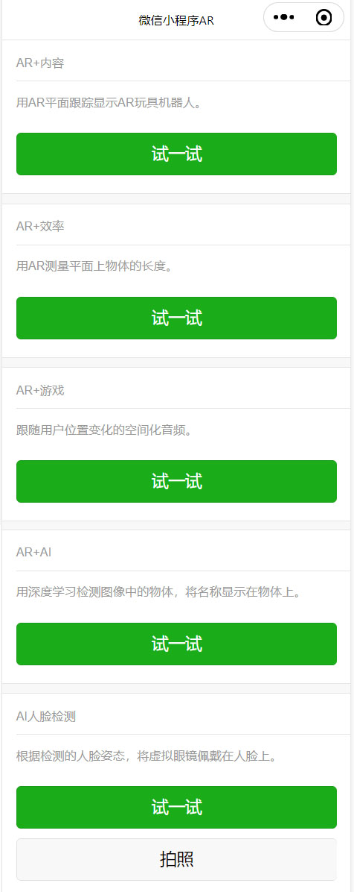
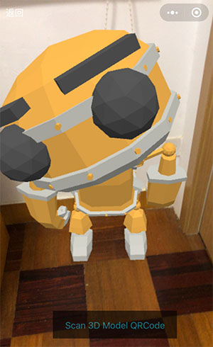

## 更新日志

| 日期　　　| 内容 |
| -- | -- |
| 2022-01-01 | 修复：Android手机画面深度冲突的第3种修改方法。 |
| 2021-12-24 | 修复：使用顶部导航条，遮挡Android手机画面的深度冲突现象。 |
| 2021-12-23夜晚 | 更新：1、平面跟踪的3D模型的默认大小可以自定义 2、3D模型从矩阵更新(matrixAutoUpdate=false)变为属性更新(matrixAutoUpdate=true)，这样可以不用矩阵调整3D模型的姿态。 |
| 2021-12-23下午 | 修复：Android手机画面左上角显示雪花的问题 |
| 2021-11-30 | 新增：1、AR试戴眼镜 2、AR测量尺子 3、AR玩具机器人固定在平面上 |


## 介绍

本项目使用微信小程序官方的API，实现了AR试戴眼镜、AR测量尺子、AR玩具机器人等。

视觉算法
https://developers.weixin.qq.com/miniprogram/dev/api/ai/visionkit/wx.createVKSession.html

人脸识别
https://developers.weixin.qq.com/miniprogram/dev/api/ai/face/wx.faceDetect.html

首页



## AI人脸检测

106个特征点的位置。本项目使用了索引值78（左眼）和79（右眼）两个特征点。


检测旋转的人脸


## AR测量尺子

点击屏幕，开始测量。请将光标的位置，对准被测量物体的两端。


再次点击屏幕，结束测量。


## AR玩具机器人固定在平面

机器人稳稳地站在房间地板上



拿着手机左右观看


拿着手机远近观看


动画


## 如何使用

使用微信开发者工具，打开项目源代码，在手机上预览。

## 如果更换3D模型

方法1：在源代码中修改robotUrl常量。

```javascript
  // 机器人模型
  const robotUrl = 'https://m.sanyue.red/demo/gltf/robot.glb';
```

方法2：首先点击“Scan 3D Model QRCode”按钮，接着扫描一个3D模型地址的二维码，然后3D模型会被更换。